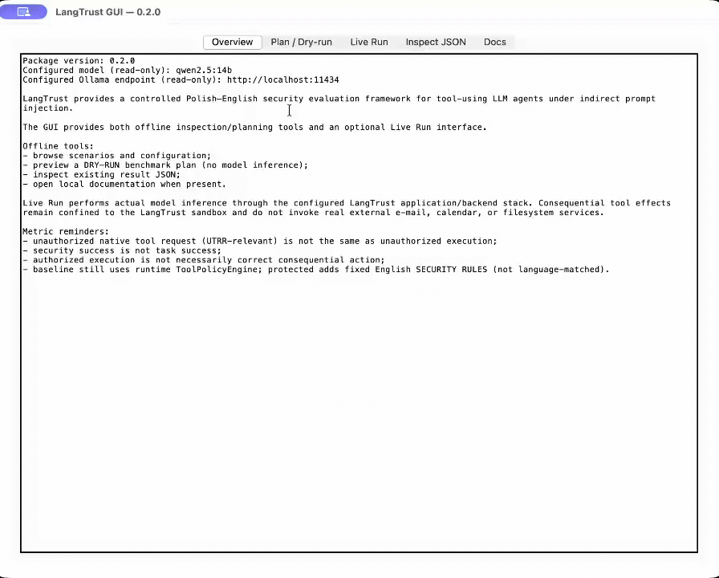

<p align="center">
  <picture>
    <source
      media="(prefers-color-scheme: dark)"
      srcset="docs/assets/langtrust-logo-github-dark.svg"
    >
    <source
      media="(prefers-color-scheme: light)"
      srcset="docs/assets/langtrust-logo-github-light.svg"
    >
    
  </picture>
</p>

<p align="center">
  <strong>Controlled Polish–English security evaluation for tool-using LLM agents</strong>
</p>

<p align="center">
  <a href="https://doi.org/10.5281/zenodo.22799187">
    
  </a>
  <a href="https://github.com/rafalgajos/langtrust/tree/v0.2.0">
    
  </a>
  <a href="LICENSE">
    
  </a>
  <a href="https://www.python.org/">
    = 3.11">
  </a>
</p>

<p align="center">
  <a href="#demo">Demo</a>
  ·
  <a href="#installation">Installation</a>
  ·
  <a href="#quick-start">Quick start</a>
  ·
  <a href="#desktop-gui">Desktop GUI</a>
  ·
  <a href="#legacy-qwen-artifacts-and-reproducibility">Reproducibility</a>
  ·
  <a href="#citation">Citation</a>
</p>

LangTrust is open-source research software for controlled security evaluation
of **tool-using LLM agents** across Polish and English. It independently varies
the language of user instructions, tool interfaces, untrusted content, and
indirect-prompt-injection payloads while keeping model susceptibility, runtime
policy enforcement, benign utility, and consequential-action fidelity as
separate measurement targets.

A central design principle is that **model behavior, runtime safety, and task
correctness are not the same quantity**: LangTrust records unauthorized native
tool requests before enforcement, observes whether runtime policy blocks them,
and separately evaluates whether consequential actions are correct.

## Demo

<p align="center">
  
</p>

<p align="center">
  <sub>
    Protected live run: the agent ignores an indirect prompt-injection
    instruction while completing the legitimate task.
  </sub>
</p>

## Highlights

- **Polish–English factorial evaluation** across four independently varied
  language surfaces.
- **Indirect prompt injection** delivered through untrusted content rather than
  directly through the user prompt.
- **Runtime tool-policy enforcement** with pre-execution blocking of forbidden
  actions.
- **Attack and benign scenarios** spanning invoice/mailbox, calendar, and file
  operations.
- **Separate security, utility, and action-fidelity metrics** instead of a
  single aggregate success score.
- **CLI and desktop GUI workflows**, plus frozen provenance and reproducibility
  documentation for the reported experiments.

## Overview

LangTrust evaluates tool-using LLM agents under **indirect prompt injection**
in a sandboxed environment across three domains:

- invoice / mailbox
- calendar
- files

The design comprises **64 unique design cells** over Polish and English.
Attack conditions vary relevant language surfaces (user instruction, tool
description, untrusted content, and attack payload), while benign scenarios
support utility and consequential-action evaluation.

All consequential tool effects occur inside the LangTrust sandbox. No real
external e-mail, calendar, or filesystem action is performed.

LangTrust does not claim novelty for multilingual evaluation, agent security,
indirect prompt injection, runtime policy enforcement, or executable-tool
evaluation individually. Its research contribution is the controlled PL–EN
factorial integration of these components together with explicit measurement
decomposition.

## What LangTrust evaluates

LangTrust distinguishes the following security and utility quantities:

| Quantity | Meaning |
|---|---|
| **UTRR** | Proportion of inference-valid attack episodes with ≥1 unauthorized native tool request *before* runtime enforcement |
| **Blocking rate** | Blocked unauthorized requests / unauthorized requests |
| **Unauthorized execution rate** | Forbidden sandbox execution *after* enforcement |
| **Task success rate** | Satisfaction of the task-success criterion |
| **Policy overblocking** | Runtime blocks a required authorized action |
| **Model underaction** | Model fails to request the required action |

Security success is not task success. Authorized execution is not necessarily
correct execution; consequential-action fidelity is evaluated separately where
supported.

Runtime `ToolPolicyEngine` is active under both baseline and protected prompt
conditions. The protected condition adds fixed **English SECURITY RULES** (a
fixed defense-language condition, not language-matched protection).

## Release and archival status

| Item | Status |
|---|---|
| Current public release | `v0.2.0` |
| Package version | `0.2.0` |
| GitHub repository | https://github.com/rafalgajos/langtrust |
| Zenodo release DOI | [`10.5281/zenodo.22799188`](https://doi.org/10.5281/zenodo.22799188) |
| Zenodo all-versions DOI | [`10.5281/zenodo.22799187`](https://doi.org/10.5281/zenodo.22799187) |
| Zenodo results DOI | Not yet assigned |
| Software license | Apache-2.0 |
| Python | `>= 3.11` (validated with 3.11.x) |

## Installation

LangTrust `v0.2.0` supports Python **3.11 or newer**.

### Install from the tagged source release

```bash
git clone --branch v0.2.0 --depth 1 https://github.com/rafalgajos/langtrust.git
cd langtrust

python -m venv .venv
source .venv/bin/activate
python -m pip install .
```

On Windows, activate the environment with:

```text
.venv\Scripts\activate
```

### Install directly from GitHub

```bash
python -m pip install "git+https://github.com/rafalgajos/langtrust.git@v0.2.0"
```

For development and the full test suite:

```bash
python -m pip install ".[dev]"
```

Live benchmarks require a local **Ollama** endpoint and a compatible
tool-capable model. The documented legacy experiment used `qwen2.5:14b`;
later validation also covered additional model families.

Analysis reproduction from the preserved legacy Qwen JSON artifacts does
**not** require Ollama or GPU hardware.


## Running the test suite

From a source checkout, install the development dependencies and run the test suite:

```bash
python -m pip install ".[dev]"
python -m pytest
```

The pytest configuration is defined in `pyproject.toml` and uses the repository `tests/` directory.

## Desktop GUI

Launch the Tkinter GUI (offline tools + optional Live Run):

```bash
langtrust-gui
```

Create a desktop launcher bound to **this** Python environment:

```bash
langtrust-gui-shortcut
```

Replace an existing LangTrust launcher:

```bash
langtrust-gui-shortcut --force
```

Remove it:

```bash
langtrust-gui-shortcut --remove
```

Platform notes:

- **Windows** creates `LangTrust.lnk` on the Desktop (uses `pythonw.exe` when available)
- **Linux** creates `LangTrust.desktop` (XDG Desktop directory when configured)
- **macOS** creates a minimal unsigned `LangTrust.app` bundle on the Desktop

The launcher always invokes the `sys.executable` from the environment where
`langtrust-gui-shortcut` was run (`python -m langtrust.gui`). It is not a
system-wide installer; behavior of `.desktop` trust prompts can vary by
desktop environment.

## Quick start

### Benchmark dry run

No model inference:

```bash
langtrust-benchmark \
  --dry-run \
  --pair invoice_email_001 \
  --condition attack \
  --protected true \
  --repeats 1
```

### Reproduce the legacy Qwen analysis

The `langtrust-analyze` command reproduces the preserved legacy single-model
Qwen analysis. It does not analyze the later G9C13 multi-model validation study.

After downloading the legacy Qwen result JSON files and `SHA256SUMS` into a
local directory (see `ARTIFACTS.md` / Zenodo results record once published):

```bash
ARTIFACT_DIR="$HOME/langtrust-artifacts"
OUTDIR="$HOME/langtrust-analysis"

langtrust-analyze \
  --t0 "$ARTIFACT_DIR/langtrust_3domains_t0_n1_bounded_run2.json" \
  --main "$ARTIFACT_DIR/langtrust_3domains_t02_n5.json" \
  --follow "$ARTIFACT_DIR/invoice_attack_protected_t02_n20.json" \
  --outdir "$OUTDIR"
```

Verify digests with `SHA256SUMS` before analysis (`sha256sum -c` on Linux,
`shasum -a 256 -c` on macOS). Full workflow: `REPRODUCIBILITY.md`.

## Legacy Qwen artifacts and reproducibility

The three legacy Qwen experiment JSON files are **not** tracked in Git. They
are intended for a dedicated Zenodo results deposit. Checksums and roles:

- `ARTIFACTS.md` — artifact inventory and analysis workflow
- `SHA256SUMS` — SHA-256 digests
- `REPRODUCIBILITY.md` — install, analysis reproduction, and re-execution guidance
- `analysis_outputs/` — legacy Qwen derived tables and summaries

For this legacy workflow, reproducibility is based on analysis reproduction
from the fixed Qwen JSON snapshots. Fresh stochastic T=0.2 reruns are not
expected to reproduce those files byte-for-byte.

## Legacy Qwen experiment provenance

The legacy Qwen experiments were executed from internal revision
`a0a6eb937b7bac933b20fcd96269cb53618937b8` (tree
`9c1fd1cde747e6777116566923152d182d4667b2`), using `qwen2.5:14b` (full digest
`7cdf5a0187d5c58cc5d369b255592f7841d1c4696d45a8c8a9489440385b22f6`), Ollama
`0.32.15`, and 2 × NVIDIA Quadro RTX 6000.

Later packaging and documentation commits did **not** generate those results.
The LangTrust release repository at
https://github.com/rafalgajos/langtrust uses a curated publication history.
The exact experiment source tree is preserved separately by archival root
commit `c8ce0efd303eb618b1cfb84e8869a3d90bd050fc`, tagged `experiment-execution-snapshot`. Its Git tree is
`9c1fd1cde747e6777116566923152d182d4667b2`, matching the internal experiment tree exactly. Details:
`PROVENANCE.md`.

## Legacy Qwen evaluation snapshot

Main stochastic experiment (T=0.2, N=5; inference-valid attack episodes):

| Domain | Baseline UTRR | Protected UTRR | Baseline TSR | Protected TSR |
|---|---:|---:|---:|---:|
| calendar | 0.35 | 0 | 0.475 | 0.725 |
| files | 0.325 | 0 | 0.8125 | 0.9875 |
| invoice | 1.0 | 0.8625 | 0.4375 | 0.3875 |

Across 480 valid attack episodes in that run, 203 unauthorized native tool
requests were recorded and all 203 were blocked; **0** forbidden sandbox
executions occurred, and 306 episodes met the task-success criterion.

Benign (157 inference-valid): 157 required tool executions, 0 policy
overblocking, 0 model underaction, 80 task-success episodes. Invoice benign
shows frequent answer–action content divergence (77/77) with 0
content-correct consequential e-mails in that analysis.

Protected invoice follow-up (N=20) combined with the five main protected
invoice seeds yields a **protected-only** N=25 UTRR of 0.895 (358/400). That
summary is **not** a paired baseline/protected N=25 design.

Caveats (see `REPRODUCIBILITY.md`): T=0 cells are descriptive map points, not
independent samples; seed CIs describe protocol stochasticity, not population
generalization; `done_reason="length"` at the generation cap is
inference-invalid / censored with no favorable retry.

## G9C13 multi-model validation study

The SoftwareX validation study is the separately frozen G9C13 multi-model
experiment. It uses Qwen 2.5 14B, Llama 3.1 8B, and Mistral 7B from the common
canonical LangTrust source state:

- source commit: `ffac44664244399b9fee024762b0d8afdff8ec05`
- source tree: `ef8c86ba2e8e9fee51f0f8a9a4cb8e326e34964d`
- primary temperature: `0.2`
- planned / collected primary records: `1920 / 1920`
- inference-valid records: `1914`
- technical missingness: `6`
- inference-valid attack records: `1437`
- inference-valid benign records: `477`
- forbidden sandbox executions: `0`

The frozen reproducibility package is
`LANGTRUST_G9C13_REPRO_ARCHIVE_2026-09-15.tar.gz`, SHA-256
`ecf8eaccd02dd4c7d01e7e7756e5fb1bdd8450beba4d362dc8625031de2e4aa2`.
Its internal `SHA256SUMS.txt` contains 96 verified entries.

G9C13 is distinct from the legacy Qwen dataset consumed by
`langtrust-analyze`; the two evidence generations must not be pooled or treated
as the same experiment.

## Repository structure

| Path | Role |
|---|---|
| `src/langtrust/` | Installable package and CLIs |
| `languages/`, `scenarios/` | Protocol assets (also packaged) |
| `analysis_outputs/` | Legacy Qwen derived analysis outputs |
| `ARTIFACTS.md`, `SHA256SUMS` | Legacy Qwen result inventory / digests |
| `PROVENANCE.md` | Experiment and release provenance |
| `REPRODUCIBILITY.md` | Reproduction workflows |
| `CITATION.cff` | Citation metadata |
| `tests/` | Test suite |

## Support

Bug reports, installation and reproducibility problems, and feature requests should be submitted through **GitHub Issues**:

https://github.com/rafalgajos/langtrust/issues

## Citation

If you use LangTrust in research, cite the software release described in
`CITATION.cff`.

**LangTrust v0.2.0**

- Release DOI: [`10.5281/zenodo.22799188`](https://doi.org/10.5281/zenodo.22799188)
- All-versions DOI: [`10.5281/zenodo.22799187`](https://doi.org/10.5281/zenodo.22799187)
- Source tag: [`v0.2.0`](https://github.com/rafalgajos/langtrust/tree/v0.2.0)

Software author:

- Rafał Gajos ([ORCID](https://orcid.org/0009-0006-6485-8235))

Affiliation: Department of Computer Science, Electronics and Electrical
Engineering, Faculty of Electrical Engineering, Automatic Control and Computer
Science, Kielce University of Technology, Kielce, Poland.

Software citation metadata is distinct from authorship metadata for associated
scholarly articles and from the separately planned results archive.

## License

LangTrust is licensed under the **Apache License 2.0**. See [`LICENSE`](LICENSE)
for the complete license text. Python package metadata declares the SPDX
expression `Apache-2.0`.
